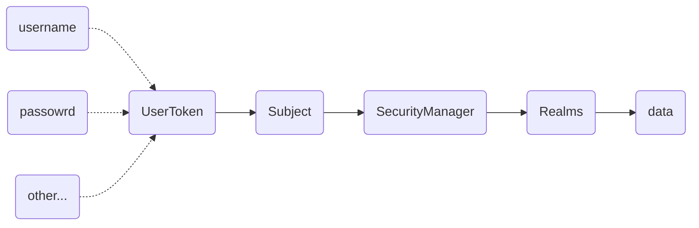

Shiro 是一个易于使用的 Java 安全框架，
它可以为绝大多数应用提供认证、授权、加密以及 Session 管理功能。

## Shiro 可以做什么

Shiro 是一个 Java 安全框架，那么正如其名，Shiro 主要的核心功能就是保证应用的安全。

那么，Shiro 如何来保证应用的安全，也就是 Shiro 的核心功能是什么？

- 认证: 提供用户认证功能，也就是通常所说的“登陆”
- 授权：验证用户的权限，对用户的访问进行控制
- 加密：通过对数据进行编码加密防止重要数据被窃取之后的风险
- Session 管理：会话管理，用于管理用户时效敏感的状态管理


## Shiro 的核心概念

在 Shiro 中有三个非常重要的核心：
- Subject
- SecurityManager
- Realms



### Subject

在 Shiro 中，Subject 可以视为当前与程序交互的用户，但是也不仅仅是“用户”，
因为这个“用户”也可能是访问应用的第三方应用或者是演示账户等。

所以，Subject 也可以简单的理解为与当前程序交互的事物。

在 Shiro 中，可以通过 `SecurityUtils` 来获取一个 `Subject` 对象：

```java
// 获取一个 Subject 对象
Subject currentUser = SecurityUtils.getSubject();
```


### SecurityManager

Subject 代表了当前与应用交互的用户，那么在 Subject 背后的就是 SecurityManager了，
所有的用户操作都需要经过 SecurityManager。

SecurityManager 是 Shiro 架构的核心，它就像是保护伞一样来管理用户的操作和数据。
SecurityManager 在程序中只需要一个实例，并且它是必须存在的。也就是说在应用中，我们配置完 SecurityManager
之后，就只需要关注业务的开发就可以了。

配置 SecurityManager 步骤：
1. 配置 Shiro 主要参数，例如加密算法、提前设置用户以及权限等
2. 加载配置并实例化 `SecurityManager` 对象
3. 通过 `SecurityUtils.setSecurityManager(securityManager)` 让 SecurityManager 在应用中生效

```java
// 使用默认的 SecurityManager
DefaultSecurityManager securityManager = new DefaultSecurityManager();
// 添加自定义的 Realm
securityManager.setRealm(new UserReal());
// 设置 SecurityManager 到应用中
SecurityUtils.setSecurityManager(securityManager);
```


### Realms

Realm 作为 Shiro 与应用数据之间的桥梁，它用来作为 Shiro 认证、授权等需要与数据进行交互操作的数据来源，
开发者可以通过实现多个 Realm 来适配多种不同的操作方式来提供认证、授权等操作。

一个简单的用户密码登陆 Realm：
```java
class UserRealm implements Realm {

    public String getName() {
        return "user";
    }

    // 仅支持用户名和密码登陆
    public boolean supports(AuthenticationToken authenticationToken) {
        return authenticationToken instanceof UsernamePasswordToken;
    }

    public AuthenticationInfo getAuthenticationInfo(AuthenticationToken authenticationToken) throws AuthenticationException {
        if (authenticationToken instanceof UsernamePasswordToken) {
            String username = ((UsernamePasswordToken) authenticationToken).getUsername();
            char[] password = ((UsernamePasswordToken) authenticationToken).getPassword();
            String pwd = new String(password);
            boolean loginSuccess = false;
            // todo 检验用户名和密码是否正确
            // 只用 root 用户能登陆
            if ("root".equals(username) && "pwd".equals(pwd)) {
                loginSuccess = true;
            }
            if (loginSuccess) {
                SimpleAuthenticationInfo info = new SimpleAuthenticationInfo(username, pwd, username);
                return info;
            } else {
                return null;
            }
        } else {
            throw new RuntimeException("not supported token");
        }
    }
}
```


## Subject 的基础操作

### 登陆

```java
// 生成令牌
UsernamePasswordToken token = new UsernamePasswordToken(username, password, rememberMe);
// 获取一个主题
Subject currentUser = SecurityUtils.getSubject();
// 将生成的令牌设置到主题中登录，后续主题将视为当前用户
try{
	currentUser.login(token);
}catch(Exception e) {
	// 登录失败
}
```

### 权限校验

```java
if (currentUser.hasRole("admin")) {
    // 展示添加用户按钮
} else {
    // 置灰添加用户按钮
}
```

### 获取 Session

```java
Session session = subject.getSession();
```


## 总结

Shiro 为应用安全提供了大多数安全相关的一站式支持，可扩展、对 Web 良好的支持。

本次笔记主要浅显的了解 Shiro 的核心功能、概念以及最基础的用法，
对于 Shiro 更多功能以及其他高级功能的使用需要了解 Shiro 相关的接口以及类，甚至是源代码。
